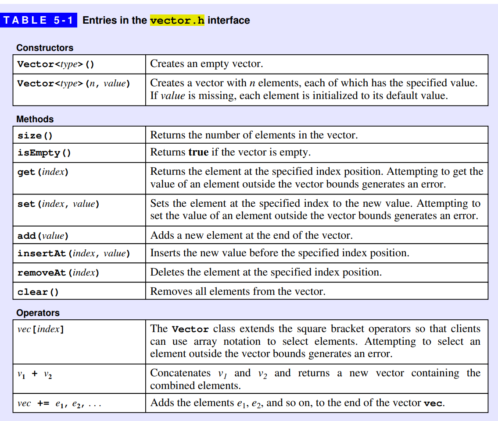
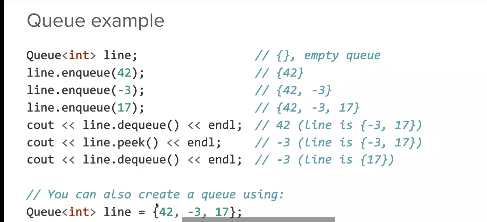
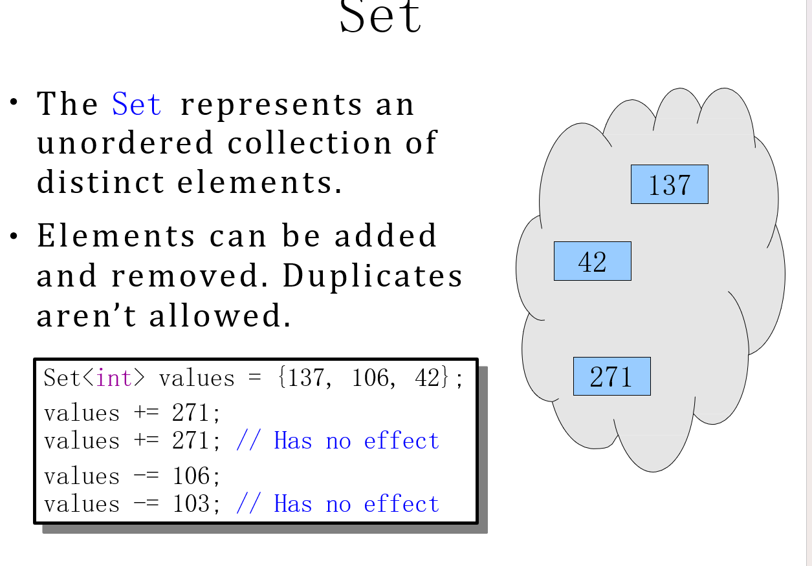
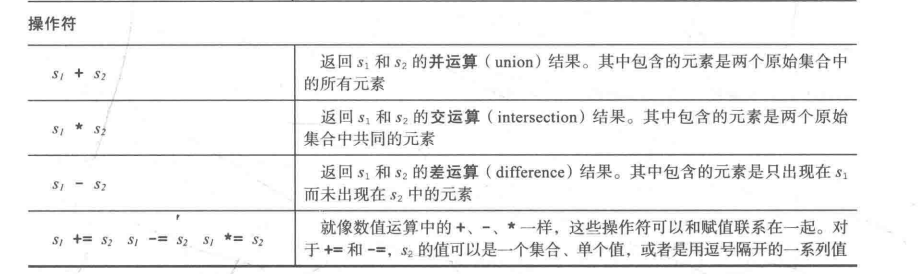

# codeLibrary

---
---

## 230328

---

- **`#include <cctype>`**
  - `isalpha(ch)` Returns true if ch is an alphabetic character.
  - `isspace(ch)` Returns true if ch is a whitespace character. These characters are ’ ’ (the space character), ‘,’‘,’, ‘, or’, all of which appear as blank space.
  - `toupper(ch)` Returns ch converted to upper case (or ch itself if ch is not a letter).
  - `tolower(ch)` Returns ch converted to lower case (or ch itself if ch is not a letter).

---

- **`#include <string>`**
  - `s.append(str)` add text str to the end of a string
  - `s.length()` or `s.size()` number of characters in this string
  - `s.replace(index,len,str)` replaces **len** chars at **index** with text **str**
  - `s.substr(start,length)` or `s.substr(start)` the next length characters beginning at **start** (inclusive);if length omitted,grabs till end of string

---

- **`#include "vector.h"`**
  - `Vector<type>(n, value)` Creates a vector with n elements, each of which has the specified value. If value is missing, each element is initialized to its default value.
  - `set(index, value)` Sets the element at the specified index to the new value. Attempting toset the value of an element outside the vector bounds generates an error.
  - `insertAt(index, value)` Inserts the new value before the specified index position.
  - `removeAt(index)` Deletes the element at the specified index position.
  - `vector<int> v = {1,2,3}`or `vector<vector<int>> vec ={{1,2},{1}}`
     > 更多用法在书上,`vector<int> v(10,2)`
  

---

- **Range-Based For循环**
  - `for (int a:arr)` or `for (char ch : word)`
  
  
  
   此为一种更改的例子，但不能立即修改
  
  > 若`:`后面是一个函数，则只会调用一次。

---

- **比大小，`.subList(1,4)` 与`.sunstr(1,4)`**
  
    

    `.subList(1,4)` 与`.sunstr(1,4)` 有不同，前者“4”为[4](但不包括）,共有3个元素；后者“4”为长度，共有4个元素。

---

- **`while(true)`内嵌 `{break;}`**
  
    ```cpp
    while(true) {
     string word = getLine("Please input the word : ");
     if (word == "") break;
     else {
       word = "csh";
      }
    } 
    ```

---

- **`#include "grid.h"`**
  - `numRows()`and`numCols()`  These methods return the number of rows and the number of columns, respectively.
  - `resize(rows, cols)`  Changes the dimensions of the grid as specified by the rows and cols parameters. Any previous contents of the grid are discarded.
  - `set(row, col, value)`  Sets the element at the specified grid coordinates to the new value.
  - `inBounds(row, col)`  Returns true if the specified row and column coordinates are inside the grid.
  - `Grid<type> value(row,col)`or`Grid<type> value = {{r0,……,cn},……,{rn,……,cn}}`

---

- **`#include "queue.h"`**  *排队（只能处理头和尾）*
  - `Queue<type> value`



---
---

## 230330

---

- **`#include "set.h"`**
  - `Set<type> values`  *元素唯一，特定排序（小到大）*
  - `add(value)` Adds the value to the set. If the value is already in the set, no error is generated,and the set remains unchanged.
  - `remove(value)` Removes the value to the set. If the value is not present, no error is generated,and the set remains unchanged.
  - `contains(value)` Returns true if the value is in the set.
  - `clear()` Removes all elements from the set.
  - `size()` Returns the number of elements in the set.
  - `isEmpty()` Returns true if the set is empty.
  - `isSubsetOf(set)` Returns true if this set is a subset of the set passed as an argument.
  - **set_addremove**
    
  - **set_operators**
    

---
---

## 230331

---

- **`#include "stack.h"`**
  - `Stack<type> values`
  - `push(value)` Pushes value on the stack so that it becomes the topmost element.
  - `pop()` Pops the topmost value from the stack and returns it to the caller. Calling pop onan empty stack generates an error.
  - `peek()` Returns the topmost value on the stack without removing it. Calling peek on an empty stack generates an error.
  - `size()`,`clear()`,`isEmpty()`

---

- **`Stack`and`Queue`**
  

---

- **`#include "map.h"`**
  - `Map<key type,value type>()`
  - `put(key, value)` Associates the specified key and value in the map. If key has no previous definition, a new entry is added; if a previous association exists, the old value is discarded and replaced by the new one.
  - `get(key)` Returns the value currently associated with key in the map. If there is no such value, get generates an error.
  - `remove(key)` Removes key from the map along with any associated value. If key does not exist, this call leaves the map unchanged.
  - `containsKey(key)` Checks to see whether key is associated with a value. If so, this methodreturns true; if not, it returns false.
  - `size()`,`isEmpty()`,`clear()`
  - `map[key]`acts as `get(key)`.If the key does not exist in the map, the square bracket operator creates a new entry and setsits value to the default for that type.

---
